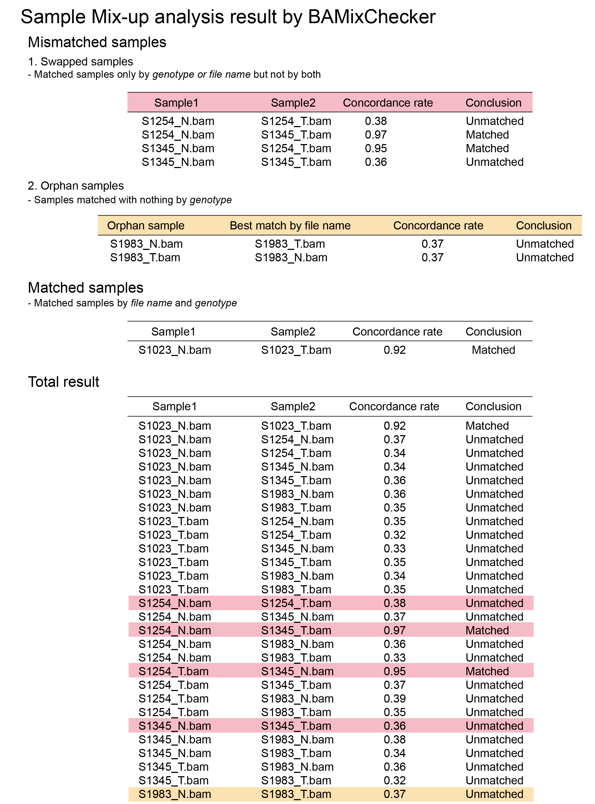
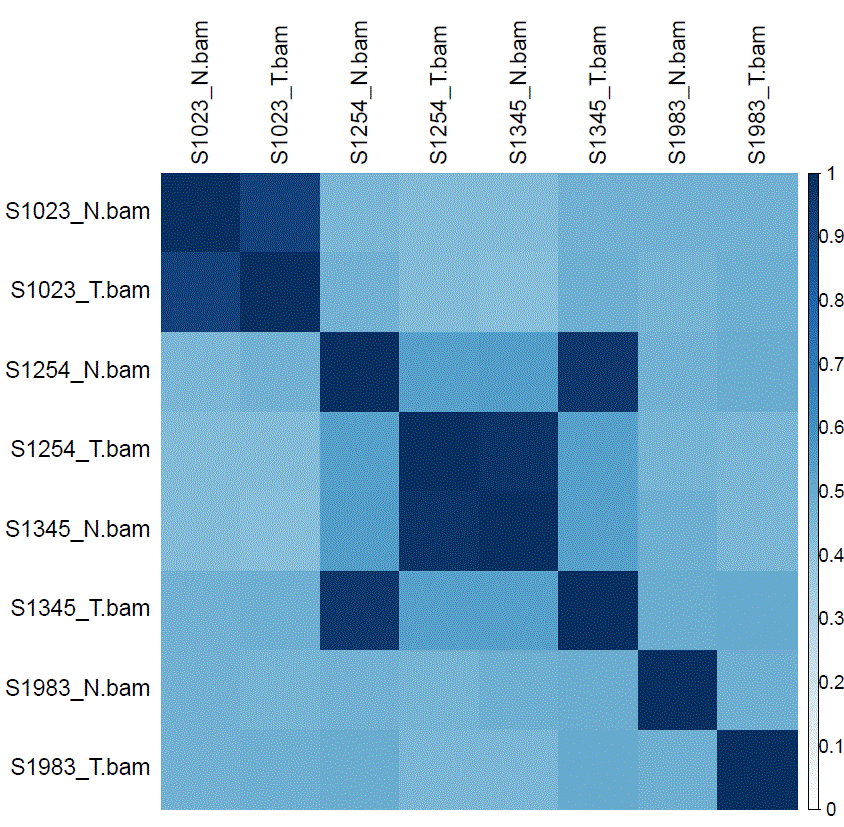

BAMixChecker:
An automated tool for sample matching checkup in NGS cohorts  
=================================================================================


BAMixChecker is a fast and easy-to-use sample matching checkup tool for NGS dataset.

It’s simple and fast but accurate to detect a pair of bam files from same individual with WGS/WES, RNA, Targeted sequencing dataset. 

And the user can catch the information of mismatched sample information as well as the matched sample information at a glance.


Required tools
------------------

#### GATK >= 4.0 ( java 8 required )

#### Bedtools

#### Python 2.7 
      - scipy.stats
      
      - numpy
      
      - multiprocessing
#### R 
      - ztable
      
      - rmarkdown
      
      - corrplot


Installation
-------------
First, clone the repository

```$ git clone https://github.com/heinc1010/BAMixChecker```

Or


Download the compressed file.

```$ unzip BAMixChecker-master.zip```

And then set the tools PATH on the configuration file, 

```$ cd BAMixChecker
  $ vim BAMixChecker.config

  GATK=/path/of/gatk
  BEDTOOLS=/path/of/bedtools

  *default (If you added the path in $PATH, you don’t need to modify the configuration file )
  GATK=gatk
  BEDTOOLS=bedtools
  ```

Input
-----------
#### BAM files
To call variants by running GATK HaplotypeCaller, each bam file should be indexed.
```
samtools index /path/Tumor_01.bam
```

To run BAMixChecker, the directory path of bam files with –d option or a list of bam files with –l is required.

The form of the list can be two types.
-Tab-divided paired files on each line. BAMixChecker pair files based on the pair information.
 ```	
  /path/Tumor_01.bam	/path/Normal_01.bam
  /path/Tumor_02.bam	/path/Normal_02.bam
  /path/Tumor_03.bam	/path/Normal_03.bam
  /path/Tumor_04.bam	/path/Normal_04.bam
```
```	
 /path/Tumor_01.bam	/path/Normal_01.bam	/path/Meta_01.bam
 /path/Tumor_02.bam	/path/Normal_02.bam	/path/Meta_02.bam
 /path/Tumor_03.bam	/path/Normal_03.bam	/path/Meta_03.bam
 /path/Tumor_04.bam	/path/Normal_04.bam	/path/Meta_04.bam
```

-One bam file on each line. BAMixChecker check the file names and evaluate whether the files are pair based on the name.
 If you want to compare files only by genotype, you can use '--OFFFileNameMatching' option.
```
  /path/Tumor_01.bam
  /path/Normal_01.bam
  /path/Tumor_02.bam
  /path/Normal_02.bam
  /path/Tumor_03.bam
  /path/Normal_03.bam
  /path/Tumor_04.bam
  /path/Normal_04.bam
```
If the number of files is under 6 or the file names don’t contain common regulation when it is divided by the delimiters, it only pairs by genotype, not by name and skips to make ‘Mismatched_sample.txt’ which is the same using '--OFFFileNameMatching' option.


* RNA-seq bam file

BAMixChecker calls variants with GVCF file which is only possible for single sample ID.

So to run GATK HapplotypeCaller, RNA-seq bam file needs to add read groups with Picard AddOrReplaceReadGroups.
```
java -jar picard.jar AddOrReplaceReadGroups \
I=RNA_T_01.sam \
O=RNA_T_01.rg_added_sorted.bam \
SO=coordinate \
RGID=project \
RGLB=library \
RGPL=platform \
RGPU=machine \
RGSM=sample
```

Additional proper processing for RNA-seq data is instructed in https://gatkforums.broadinstitute.org/gatk/discussion/3891/calling-variants-in-rnaseq.

#### Reference file

To call with GATK HaplotypeCaller, it requires proper reference sequence file with '.fai' file and '.dict' file for the reference which is the *same* reference used to align your bam files.

iGenomes provides 'Ready-To-Use' reference sequence file of various species including human with the annotation files.

https://support.illumina.com/sequencing/sequencing_software/igenome.html

Or, you can create by your self with samtools and Picard.
```
samtools faidx Homo_sapiens.GRCh38.fa
```
```
java -jar picard.jar CreateSequenceDictionary \
R=Homo_sapiens.GRCh38.fa \
O=Homo_sapiens.GRCh38.dict
```
see more details in https://gatkforums.broadinstitute.org/gatk/discussion/1601/how-can-i-prepare-a-fasta-file-to-use-as-reference .

#### SNP list for non-human organism
BAMixChecker runs for human as default. However, it also can be applied to other species with ‘--NonHumanSNPlist’ option for customized SNP list and proper reference. To extract only informative region, SNP list analyzed in a large population is required. It’s hard to generalize the method to select informative SNPs because annotation in each database is various. However, a mandatory annotation is MAF in the population. In addition to MAF, annotation about region affecting mappability is useful to select informative loci. Recommended SNP loci selection steps are below: 
1. Filter uncertain variants out from a list of SNP in large genomic analysis database of the organism with annotations the database offers like basic calling filter of a caller, mapping quality condition, etc.
2. Remove SNPs in a not well mappable region like a low complex region, a segment duplicated regions, and a simple repeat region, etc. It can be annotated on the database or you can get the region information in UCSC genome browser (Kent, et al., 2002) for example of simple repeat region. 
3. Among the well mappable SNPs, select only higher MAF SNP loci. For human, global MAFs over 0.45 and under 0.55 and MAFs over 0.35 and under 0.65 within each population are applied. If the database doesn’t have MAF information in each population, it can be skipped but also consider higher global MAF condition if the SNP set is too big because of lack of proper filtering annotation earlier steps. 
If the dataset is targeted sequencing dataset, the SNP set is considered not only higher MAF but also the number of SNPs. To compare genotype of samples, enough number of SNP loci to compare is required. For human data, BAMixChecker adjusts MAF condition to contain SNPs over 200 for a dataset with the target region information from BED file. Even though SNPs under 50 could discriminate in RNA-seq with the condition which is global MAFs over 0.45 and under 0.55 and MAFs over 0.35 and under 0.65 within each population, we recommend SNPs set having over 200 loci because the possibility of mutation is decreasing by decreasing MAF. It can’t be automated for non-human organism because of a uncertainness of each database annotation. Instead of it, users can check the number of SNPs in the targeted region with bedtools. The command is 
```
	bedtools intersect –a SNP_LIST.BED –b TARGETED.BED | wc –l
```
       If the number is too small, we recommend adjusting MAF condition. 
       To reduce calling time, we suggest to give the intersected SNPs creating with a command 
```
	bedtools intersect –a SNP_LIST.BED –b TARGETED.BED > snp_list.targeted_only.bed
```
Another precaution is that the contigs in the generated SNP list should be included in the reference contigs.

ex)SNP list contigs : [chr1, chr2,...] , Reference contigs : [chr1, chr2, ... ]  .... working

   SNP list contigs : [1, 2,...] , Reference contigs : [chr1, chr2, ... ]        .... ERROR
    
It should be the same with contigs in BAM files. ( If the reference is the same with the one to align the BAM files, it would be same with the reference contigs )


Additionally, user can refer http://evodify.com/gatk-in-non-model-organism/ for bam file processing for non-human organism. 


Usage
------
#### Required arguments
```
-d –-DIR Directory path of the .BAM files 
or
-l --List A file with the list of files ( The form is referred above in the 'Input' section )

-r --Ref Reference file

additionally for the Targeted sequencing dataset
-b --BEDfile  Targeted bed file for Targeted sequencing data mode.
```
#### Optional arguments
```
-v –-RefVer ['hg38','hg19']. Default is “hg38”. If the reference is hg19, give this option ‘-r hg19’.
-o --OutputDIR Output directory path. BAMixChecker creates the new directory '/BAMixChecker' under the current directory as a default.
-p --MaxProcess The max number of process. Default = 1
--FullPATH Use to report with the full path of the file. BAMixChecker resports with the only file name as a default.
--RemoveVCF Use this option to remove called VCF files after running
--OFFFileNameMatching Use this option to compare files only by genotype.
-nhSNP --NonHumanSNPlist SNP list for non-human organism sample matching check-up. 
-pld' '--Ploidy' Ploidy of sample. Default = 2 for human.
```

#### BAMixChecker runs a mode for WES and RNA-seq as a default without bed file.  
#### If a bed file is given with –b option, it runs as a targeted sequencing mode.


#### 1)	Whole genome or Whole Exome data or RNA sequencing data
```
  $ python BAMixChecker.py \
  –d /path/aligned/files/ \
  -r /path/reference/HG38/genome.fa \
  –o /path/new/directory 
  ```
 Or
  ```
  $ python BAMixChecker.py \
  –l /path/aligned/file_list.txt \
  –p 3 \
  -r /path/reference/HG38/genome.fa \
  –o /path/new/directory
```

#### 2)	Targeted sequencing data
 ```
  $ python BAMixChecker.py \
  –d /path/aligned/files/ \
  –p 2 \
  -r /path/reference/HG19/genome.fa \
  –o /path/new/directory \
  –v hg19 \
  -b /path/targeted.bed
```
Or 
```
  $ python BAMixChecker.py \
  –l /path/aligned/file_list.txt \
  -r /path/reference/HG19/genome.fa \
  –o /path/new/directory \
  –v hg19 
  -b /path/targeted.bed
```
#### If the dataset consists of both of WES/RNA-seq and Targeted sequencing data mapping with the same reference, run as targeted sequencing data mode with the targeted bed file for the Targeted sequencing data.


Output
--------
BAMixChecker reports the result of sample matching analysis in .html file and heatmap in.pdf as well as .txt.
#### “BAMixChecker_report.html"


#### “BAMixChecker_heatmap.pdf"


#### “Mismatched_samples.txt"
  ```
  #Matched samples only by genotype or file name but not by both
  S1254_N.bam		S1254_T.bam	       0.38	             Unmatched
  S1254_N.bam		S1345_T.bam	       0.97	             Matched
  S1345_N.bam		S1254_T.bam	       0.95	             Matched
  S1345_N.bam		S1345_T.bam	       0.36	             Unmatched
  
  #Samples matched with nothing by genotype
  S1983_N.bam 
	  -> pair by name with S1983_T.bam (score : 0.37 )
  S1983_T.bam 
	  -> pair by name with S1983_N.bam (score : 0.37 )
```

#### “Matched_samples.txt”
  ```
  #Matched pair by genotype and name.
  S1023_N.bam		S1023_T.bam		0.92		  Matched
  ```
  
#### “Total_result.txt”
  ```
  S1023_N.bam 		S1023_T.bam 		0.92		Matched
  S1023_N.bam		S1254_N.bam    	        0.37		Unmatched
  S1023_N.bam		S1254_T.bam 		0.34   		Unmatched
  S1023_N.bam		S1345_N.bam		0.34		Unmatched
  S1023_N.bam		S1345_T.bam		0.36 		Unmatched
  S1023_N.bam		S1983_N.bam		0.36		Unmatched
  S1023_N.bam		S1983_T.bam 		0.35		Unmatched
  S1023_T.bam		S1254_N.bam		0.35		Unmatched
  .....
  S1254_N.bam   	S1254_T.bam 		0.38 		Unmatched
  S1254_N.bam    	S1345_N.bam		0.37		Unmatched
  S1254_N.bam    	S1345_T.bam 		0.97		Matched
  .....
```

Tutorial
---------
1. Set the required variants

```
   $ cd BAMixChecker/tutorialData
   $ vim script_example.sh
   
    BAMixChecker_PATH=/path/to/BAMixChecker
    OUT_DIR=/output/dir
    REF=/path/of/reference/hg38/genome.fa
  
```
2. Run the script
```
   $ sh script_example.sh
```
Contact
--------
If you have any question, contact to license manager (hein17@yuhs.ac) or corresponding author (swkim@yuhs.ac).
