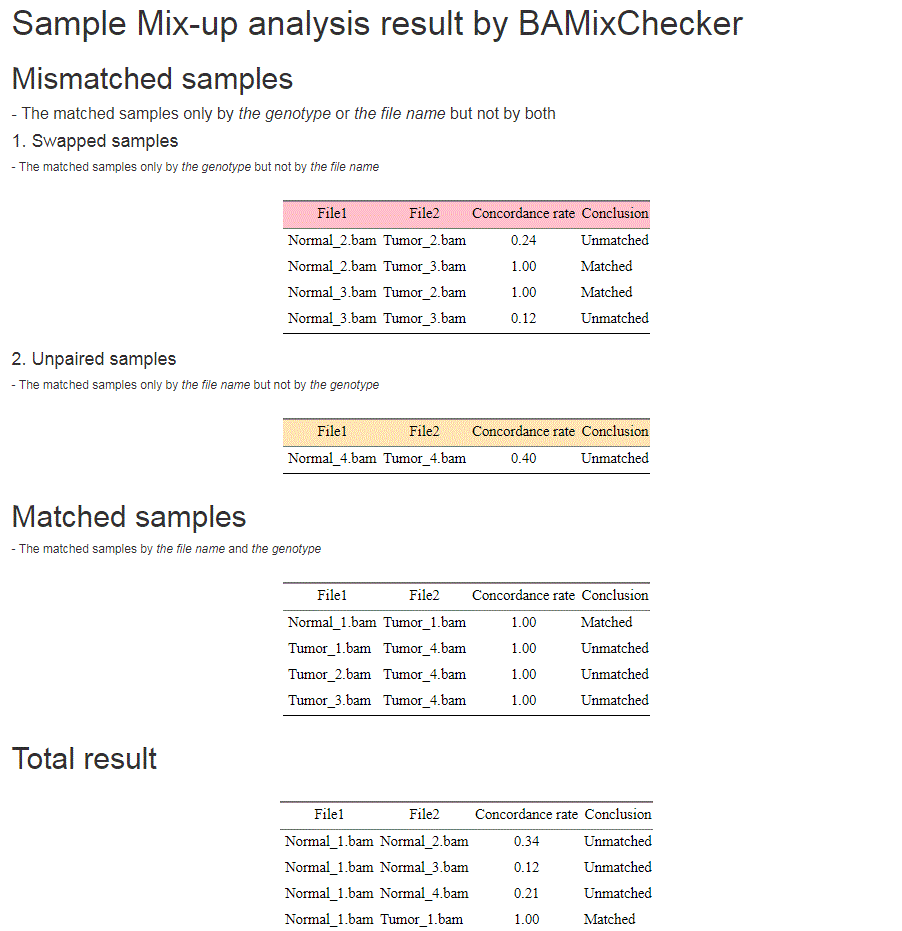

BAMixChecker:
A fast and efficient tool for sample matching checkup 
=================================================================================


BAMixChecker is a fast and easy-to-use multiple bam files match tool to detect a pair of samples from each individual.

It’s simple and fast but robust to detect a pair of bam files from same individual with WGS/WES, RNA, Targeted sequencing dataset. 

And the user can catch the information of mismatched sample information as well as the matched sample information at a glance.


Required tools
------------------

#### GATK >= 4.0 ( java 8 required )

#### Bedtools

- The tool PATH is needed to be set on “BAMixChecker.config” file.

#### Python 2.7 

packages

- scipy.stats

- numpy

- multiprocessing
   

Instruction
-------------
First, clone the repository

```$ git clone https://github.com/heinc1010/BAMixChecker```

Or


Download the compressed file.

```$ unzip BAMixChecker-master.zip```

And then set the tools PATH on the configuration file, 

```$ cd BAMixChecker
  $ vim BAMixChecker.config

  GATK=/path/of/gatk
  BEDTOOLS=/path/of/bedtools

  *default (If you added the path in $PATH, you don’t need to modify the configuration file )
  GATK=gatk
  BEDTOOLS=bedtools
  ```

Input
-----------
To run MuBaMer, the directory path of bam files with –d option or a list of bam files with –l is required.
A pair of sample list or directory information is needed.


It only gets pairs of samples. 

The form of the list can be two types.


-Tab-divided paired files on each line. BAMixChecker pair files based on the pair information.
  ```	
  /path/Tumor_01.bam /path/Normal_01.bam
  /path/Tumor_02.bam /path/Normal_02.bam
  /path/Tumor_03.bam /path/Normal_03.bam
  /path/Tumor_04.bam /path/Normal_04.bam
```

-One bam file on each line.  BAMixChecker check the file names and evaluate whether the files are pair based on the name.
```
  /path/Tumor_01.bam
  /path/Normal_01.bam
  /path/Tumor_02.bam
  /path/Normal_02.bam
  /path/Tumor_03.bam
  /path/Normal_03.bam
  /path/Tumor_04.bam
  /path/Normal_04.bam
```

#### If the number of files is under 6 or the file names don’t contain common regulation when it is divided by the delimiters, it only pairs by genotype, not by name and skip to make ‘Mismatched_pair.txt’

Usage
------
#### Required arguments
```
-d –-DIR Directory path of the .BAM files 
or
-l --List A file with the list of files ( The form is refered above in the 'Input' section )

-r --Ref Reference file

additionally for the Targeted sequencing data mode
-b --BEDfile  Targeted bed file for Targeted sequencing data mode.
```
#### Optional arguments
```
-v –-RefVer ['hg38','hg19']. Default is “hg38”. If the reference is hg19, give this option ‘-r hg19’.
-o --OutputDIR Output directory path. BAMixChecker creates the new directory '/BAMixChecker' under current directory as a default.
-p --MaxProcess The max number of process. Default = 4
--RemoveVCF Use this option to remove called VCF files after running
```

#### BAMixChecker runs a mode for WES and RNA-seq as a default without bed file.  
#### If a bed file is given with –b option, it runs as targeted sequencing mode.


#### 1)	Whole Exome data or RNA sequencing data
```
  $ python BAMixChecker.py \
  –d /path/aligned/files/ \
  -r /path/reference/HG38/genome.fa \
  –o /path/new/directory 
  ```
 Or
  ```
  $ python BAMixChecker.py \
  –l /path/aligned/file_list.txt \
  –p 3 \
  -r /path/reference/HG38/genome.fa \
  –o /path/new/directory
```

#### 2)	Targeted sequencing data
 ```
  $ python BAMixChecker.py \
  –d /path/aligned/files/ \
  –p 2 \
  -r /path/reference/HG19/genome.fa \
  –o /path/new/directory \
  –v hg19 \
  -b /path/targeted.bed
```
Or 
```
  $ python BAMixChecker.py \
  –l /path/aligned/file_list.txt \
  -r /path/reference/HG19/genome.fa \
  –o /path/new/directory \
  –v hg19 
  -b /path/targeted.bed
```
#### If the dataset consists of both of WES/RNA-seq and Targeted sequencing data mapping with same reference, run as targeted sequencing data mode with the targeted bed file for the Targeted sequencing data.


Output
--------
BAMixChecker reports the result of sample matching analysis in .html file as well as .txt.
#### “BAMixChecker_report.html"


#### “Mismatched_pair.txt"
  ```
  #Matched samples only by genotype or file name but not by both
  S1254_N.bam		S1254_T.bam	       0.38	             Unmatched
  S1254_N.bam		S1345_T.bam	       0.97	             Matched
  S1345_N.bam		S1254_T.bam	       0.95	             Matched
  S1345_N.bam		S1345_T.bam	       0.36	             Unmatched
  
  #Samples matched with nothing by genotype
  S1983_N.bam 
	  -> pair by name with S1983_T.bam (score : 0.37 )
  S1983_T.bam 
	  -> pair by name with S1983_N.bam (score : 0.37 )
```

#### “Matched_pair.txt”
  ```
  #Matched pair by genotype and name.
  S1023_N.bam		S1023_T.bam		0.92		  Matched
  ```
  
#### “Total_result.txt”
  ```
  S1023_N.bam 		S1023_T.bam 		0.92		Matched
  S1023_N.bam		S1254_N.bam    	        0.37		Unmatched
  S1023_N.bam		S1254_T.bam 		0.34   		Unmatched
  S1023_N.bam		S1345_N.bam		0.34		Unmatched
  S1023_N.bam		S1345_T.bam		0.36 		Unmatched
  S1023_N.bam		S1983_N.bam		0.36		Unmatched
  S1023_N.bam		S1983_T.bam 		0.35		Unmatched
  S1023_T.bam		S1254_N.bam		0.35		Unmatched
  ...
  S1254_N.bam   	S1254_T.bam 		0.38 		Unmatched
  S1254_N.bam    	S1345_N.bam		0.37		Unmatched
  S1254_N.bam    	S1345_T.bam 		0.97		Matched
  ...
```

Contact
--------
If you have any question, contact to license manager (hein17@yuhs.ac) or corresponding author (swkim@yuhs.ac).
