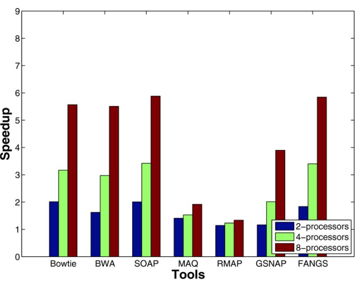

======================================
Issues
======================================

Running time of BAMixChecker
-------------------------------

In our paper, we reported the running time of BAMixChecker which showed 5.3 min with 4 processes and 9.9 min with 1 process for WES. 

The same non-linear speed tendancy also showed in records for the targeted sequencing dataset.

We suspect that the non-linearity between the number of CPU and the gain in speed can be explained by followings: 

(a) the genuine problem in the “divide-and-conquer” strategy and (b) environmental effects in the speed measurement. 

W.r.t. (a), the achieved gain in speed is generally lower than theoretical values in many problems because there are steps for ‘dividing’ data and ‘combining’ the calculated results outside of the multi-process parts. 

For instance, in a benchmark study for short read alignment problem (Hatem, et al., 2013), the gain in speed is lower than the number of processors (Figure 2). 

We think that the calculation in our problem also falls in the same problem. 

W.r.t. (b), we also found that the usage pattern of CPU resources can be another reason. 

In the speed benchmark, we used a desktop with Intel® Core™ i7-4790 CPU 3.60GHz with quad cores and 32 GB memory. 

We noted that the GATK program (in our pipeline) requires higher CPU usage in the beginning passage, which causes a short bottleneck, which is resolved afterwards.  

Figure 2. Relationship between the number of processors and the gain in speed in the short read alignment problem. With 4- and 8-processors, the observed gains in speed are 1.5x-3.5x (green bars) and 2x-6x (red bars), respectively.

**Reference**

Hatem, A., et al. Benchmarking short sequence mapping tools. BMC Bioinformatics 2013;14(1):184.

