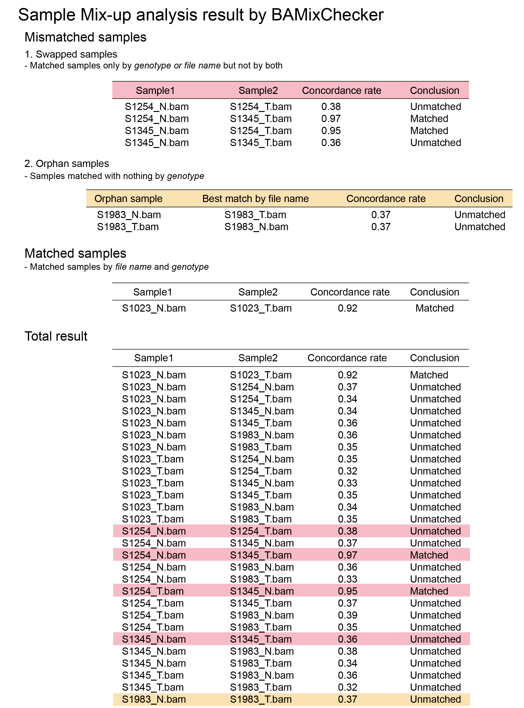

======================================
Output
======================================

Report of BAMixChecker
-----------------
Sample mismatch check-up analysis report of BAMixChercker in .HTML.

Heatmap
------------------------------
Sample mismatch check-up analysis result of BAMixChercker in heatmap with .PDF.

.. image:: Heatmap_ex.gif
    :alt: BAMixChecker_heatmap.pdf
    :width: 500

TEXT files
---------------------------------------

* **Mismatched_samples.txt**::

    #Matched samples only by genotype or file name but not by both
    S1254_N.bam		S1254_T.bam	       0.38	             Unmatched
    S1254_N.bam		S1345_T.bam	       0.97	             Matched
    S1345_N.bam		S1254_T.bam	       0.95	             Matched
    S1345_N.bam		S1345_T.bam	       0.36	             Unmatched
    
    #Samples matched with nothing by genotype
    S1983_N.bam 
        -> pair by name with S1983_T.bam (score : 0.37 )
    S1983_T.bam 
        -> pair by name with S1983_N.bam (score : 0.37 )

* **Matched_samples.txt**::

    #Matched pair by genotype and name.
    S1023_N.bam		S1023_T.bam		0.92		  Matched
  
* **Total_result.txt**::

    S1023_N.bam 	S1023_T.bam 		0.92		Matched
    S1023_N.bam		S1254_N.bam    	        0.37		Unmatched
    S1023_N.bam		S1254_T.bam 		0.34   		Unmatched
    S1023_N.bam		S1345_N.bam		0.34		Unmatched
    S1023_N.bam		S1345_T.bam		0.36 		Unmatched
    S1023_N.bam		S1983_N.bam		0.36		Unmatched
    S1023_N.bam		S1983_T.bam 		0.35		Unmatched
    S1023_T.bam		S1254_N.bam		0.35		Unmatched
    .....
    S1254_N.bam   	S1254_T.bam 		0.38 		Unmatched
    S1254_N.bam    	S1345_N.bam		0.37		Unmatched
    S1254_N.bam    	S1345_T.bam 		0.97		Matched
    .....
